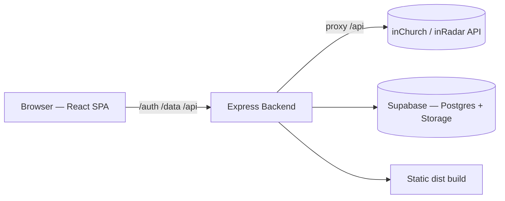

# Agenda CCLX — Architecture & Overview

Interactive calendar/agenda for **CCLX (Comunidade Cristã de Lisboa)**, a church
organization with multiple local congregations. This document summarizes the
app's objectives, functionalities, architecture, and components.

---

## 1. Objective

Provide an online agenda for the organization to **manage and publish events**
across its **8 churches** (Sede, Açores, Almada, Barreiro, Caldas da Rainha,
Coruche, Moita, Porto), with:

- A **public view** open to everyone (read-only, with filters).
- A **management backoffice** for authenticated staff (users, roles, churches,
  event lifecycle).
- A **private agenda** where some events are only visible to authorized users.

The application is the **System of Record (SoR)** — the source of truth for all
events — and additionally **merges** read-only events pulled from the external
**inChurch / inRadar** API into the public calendar.

---

## 2. Core Functionalities

### Public calendar
- Multiple views: **Day, Week, Month, Quarter, Semester, Year**.
- Mini-month quick navigator and a navy lateral sidebar ("Smart School" look).
- Free-text **search** (Fuse.js) over title/description.
- **Filters** by church (community) and by category (`culto`, `jovens`,
  `formação`, `evento`).
- **Export** events to `.ics`.
- Light/dark **theme** toggle (light default), responsive, PT-PT, accessibility.

### Two merged event sources
- **inChurch / inRadar API** (`/api/event/`, ~2500 events) — read-only, flagged
  with an `APP` badge.
- **SoR backend** — events created and published in the backoffice.
- Sources are merged, de-duplicated (inChurch IDs prefixed `ic-`), sorted, and
  cached (5-min TTL). **Resilient**: if one source fails, the other still shows;
  it only errors when *both* fail. A single on/off toggle controls whether
  inChurch events appear publicly.

### Authentication & roles
- **Passwordless OTP via email**; session is a **JWT** in an httpOnly cookie.
- Four roles:
  | Role | Scope |
  |------|-------|
  | **admin** | Full access, all churches; manages users, API, reports, full event lifecycle. Only role that ignores per-church scope. |
  | **aprovador** | Manages and approves/rejects events for assigned churches; sees reports. |
  | **editor** | Same event capabilities as aprovador but scoped to assigned churches; sees reports. |
  | **visitante** | Read-only agenda, but can see private events. |

### Event lifecycle (approval workflow)
- States: `Rascunho → Pendente → Publicado` (or `Rejeitado`).
- Only **published** events appear publicly; drafts/pending show with a badge to
  managers only.
- Each state transition is recorded in an **audit history**.
- A user cannot approve their own event (separation of duties), except admins.

### Event management (backoffice `ManagePanel`)
- Full **CRUD** with church scoping enforced server-side.
- **Image upload** to the server (PNG/JPG only, 16:9, ≤5MB, click or drag).
- **Recurring events** (daily/weekly/monthly) materialized as a series.
- DB-managed **churches, categories, and privacy tags**.
- **CSV user import** with a downloadable template.
- **Reports** (by status, church, category, privacy, upcoming, recent activity).

### Privacy
- **Private events** + **privacy tags**: a private event is visible only if its
  tag is within the user's allowed subset (or the user has "all tags").

---

## 3. High-Level Architecture



**Single-process deployment**: in production the Express backend also serves the
built Vite frontend (same-origin), so it runs as **one Node.js process** on
**Hostinger** shared hosting. The frontend uses relative paths (`/auth`, `/data`,
`/api`), so dev (Vite proxy on `:5173` → backend `:4000`) and prod both work
without code changes.

---

## 4. Frontend (`src/`)

**Stack:** React 18 + Vite, TanStack Query (data/cache), framer-motion
(animation), sonner (toasts), Fuse.js (search), date-fns, zod. Styling via CSS
Modules with navy chrome + gold (`#F5A800`) accent tokens.

```
src/
├── App.jsx                  # Root: views, filters, auth state, range loading
├── main.jsx                 # Entry point
├── services/
│   ├── apiService.js        # Merges + caches both event sources, date-range loading
│   ├── authService.js       # OTP request/verify, session
│   └── eventsService.js     # CRUD for events, users, churches, categories, tags, uploads
├── hooks/
│   ├── useAuth.jsx          # Session, role, canViewPrivate
│   ├── useEvents.js         # Event query (keyed by range + visibility flags)
│   ├── useTheme.js          # Light/dark theme
│   ├── useChurches.js  useCategories.js  usePrivacyTags.js
│   ├── useLocalStorage.js   useModalA11y.js
├── components/
│   ├── MonthView · WeekView · DayView · MiniMonth   # Calendar views
│   ├── CalendarSidebar      # Navy sidebar (selected day, filters, new event)
│   ├── EventCard · EventDetail                       # Event display (16:9 banner)
│   ├── ManagePanel          # Backoffice: events / users / API / reports / churches / categories / privacy tags
│   ├── LoginModal · ExportModal · SearchBar
│   ├── CommunityFilter · CategoryFilter · ThemeToggle
│   └── CalendarSkeleton     # Loading state
└── utils/
    ├── calendarHelpers.js   # Ranges, date formatting, status/category/API metadata
    ├── churches.js          # Canonical church list & helpers
    └── icsExport.js         # .ics generation
```

Key behaviors:
- `apiService.fetchEvents(from, to, opts)` loads inChurch (filtered client-side)
  and SoR (filtered server-side by date range) in parallel via
  `Promise.allSettled`, caches per source.
- Visibility is a tri-state (`all` / `private` / `public`); managers always see
  drafts with a badge.

---

## 5. Backend (`server/src/`)

**Stack:** Express 4, pg (node-postgres), @supabase/supabase-js (Storage),
jsonwebtoken, nodemailer (OTP email), multer (uploads), cookie-parser, cors,
express-rate-limit, zod. Feature-module layout —
each module has `repository.js` (DB), `service.js` (logic + validation), and
`routes.js` (HTTP).

```
server/src/
├── index.js                 # App wiring, route mounting, serves dist (frontend)
├── config.js                # Env config (DB, Supabase, JWT, OTP, SMTP, CORS, inRadar)
├── middleware/auth.js       # loadUser, requireAuth, requireRole
├── auth/                    # email.js, jwt.js, otp.js, routes.js  (OTP + JWT)
├── events/                  # repository/service/routes + integration test
├── users/                   # Admin-only user CRUD (last-admin protection)
├── churches/                # DB-driven church CRUD
├── categories/              # DB-driven category CRUD
├── privacyTags/             # Privacy tag CRUD (immutable names)
├── settings/                # inChurch integration on/off toggle
├── reports/                 # Aggregated reports for staff
├── uploads/                 # multer → Supabase Storage image upload (PNG/JPG, ≤5MB)
├── storage/supabase.js      # Supabase Storage client (event image uploads)
├── routes/
│   ├── admin.js             # /data public + calendar endpoints
│   └── inradar.js           # inChurch /api proxy (credentials stay server-side)
├── integrations/inchurch.js # (legacy outbound sync — now dead code)
└── db/
    ├── pool.js              # node-postgres (pg) pool; bigint→Number parser
    ├── schema.sql           # Tables (PostgreSQL)
    ├── migrate.js  seed.js  # Migration + admin/churches/categories seeding
```

### Route map
| Prefix | Purpose | Access |
|--------|---------|--------|
| `GET /health` | Health check | public |
| `/api/*` | inChurch/inRadar proxy | public (server holds credentials) |
| `/auth/*` | OTP request/verify, session, me | public + authed |
| `/data/events` | Public/calendar reads + CRUD | mixed (role-gated) |
| `/data/integration` | inChurch toggle | admin (public flag read) |
| `/data/users` | User management | admin |
| `/data/reports` | Reports | admin / aprovador / editor |
| `/data/churches` `/data/categories` `/data/privacy-tags` | Reference data | read: authed, write: admin |
| `/data/uploads` | Image upload → Supabase Storage | upload: managers |

### Database (Supabase / PostgreSQL)
Accessed through **`pg` (node-postgres)** using native `$N` placeholders.
`db/pool.js` opens a small TLS pool to the Supabase **Supavisor** pooler
(session mode, port 5432) and registers a global `bigint → Number` type parser
so `COUNT`/`SUM` come back as numbers. Postgres-native types are used directly:
`TEXT[]` (e.g. `users.churches`, `users.privacy_tags`), `JSONB`
(`app_settings.value`), `BOOLEAN`, `TIMESTAMPTZ`, and `UUID` primary keys
(`gen_random_uuid()` / app-generated `crypto.randomUUID()`).

Main tables: `users`, `events`, `event_history`, `churches`, `categories`,
`privacy_tags`, `app_settings`, `otp_codes`.

Image uploads no longer touch local disk — they stream to **Supabase Storage**
(`server/src/storage/supabase.js`) and the public URL is stored on the event.

### Security
- zod validation at boundaries; rate limiting on auth.
- CORS with credentials; httpOnly, `secure` (prod), `sameSite=lax` cookies behind
  a trusted proxy (`trust proxy` in prod).
- Role-based authorization middleware; per-church scoping enforced server-side.
- inChurch credentials never reach the browser (server-side proxy only).

---

## 6. Event Categories

Categories are DB-managed; for inChurch events they are inferred from the name:

| Category | Inferred when the name contains |
|----------|---------------------------------|
| **Culto** | Celebração, Culto |
| **Jovens** | LOUD, Jovens |
| **Formação** | Grupo, Crescimento, GC, Formação, Escola, B1, Be One, Oficina |
| **Evento** | anything else (default) |

---

## 7. Build, Test & Deploy

### Scripts (root `package.json`)
| Script | Purpose |
|--------|---------|
| `npm run dev` | Vite dev server (`:5173`, proxies `/auth` `/data` → `:4000`) |
| `npm run build` | Build frontend → `dist/` (runs `postbuild` to install server deps) |
| `npm start` | Run the Node backend (also serves `dist/`) |
| `npm test` | Frontend tests (Vitest) |
| `npm run db:migrate` / `db:seed` | DB migration / seed (via server) |

Backend dev: `cd server && npm run dev` (`node --watch`, `:4000`).

### Testing
- **Frontend:** Vitest + Testing Library (~49 tests).
- **Backend:** Node built-in test runner (`node --test`), incl. integration
  tests against PostgreSQL (Supabase, or a local Postgres).

### Deployment
- One Node.js app; Express serves both the API and the compiled frontend.
- DB: **Supabase (managed Postgres)** — `DATABASE_URL` points at the Supavisor
  session pooler (port 5432) with `DB_SSL` enabled.
- Images: **Supabase Storage** (public bucket) — set `SUPABASE_URL`,
  `SUPABASE_SERVICE_ROLE_KEY` (backend only) and `SUPABASE_STORAGE_BUCKET`.
- Required env: `NODE_ENV`, `JWT_SECRET`, `OTP_PEPPER`, `DATABASE_URL`, `DB_SSL`,
  `SUPABASE_URL`, `SUPABASE_SERVICE_ROLE_KEY`, `SUPABASE_STORAGE_BUCKET`,
  `CORS_ORIGIN`, `SMTP_*` (needed for OTP login), `INCHURCH_API_KEY/SECRET`.
- `vite` and `@vitejs/plugin-react` are runtime dependencies so the host can
  build with `NODE_ENV=production`.

---

## 8. Tech Stack Summary

| Layer | Technologies |
|-------|--------------|
| **Frontend** | React 18, Vite, TanStack Query, framer-motion, sonner, Fuse.js, date-fns, zod, CSS Modules |
| **Backend** | Node.js ≥20, Express 4, mysql2, jsonwebtoken, nodemailer, multer, cookie-parser, cors, express-rate-limit, zod |
| **Database** | MySQL / MariaDB |
| **Auth** | Passwordless OTP (email) + JWT (httpOnly cookie) |
| **External** | inChurch / inRadar API (read-only, server-proxied) |
| **Tooling** | ESLint, Prettier, Vitest, Node test runner |
| **Hosting** | Hostinger shared hosting (single Node process + Nginx/LiteSpeed) |
