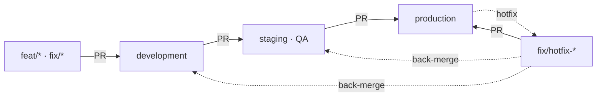

# Estratégia de branches e ambientes — Agenda CCLX

Fluxo **development → staging (QA) → production** sobre GitHub + Vercel (Hobby) +
Supabase. Este documento descreve os branches, o fluxo de promoção e a
configuração da Vercel e do Supabase por ambiente.

> Deploy detalhado (variáveis, Supabase, migrações): ver [`DEPLOY.md`](./DEPLOY.md).

---

## 1. Branches

| Branch | Ambiente | Deploy Vercel | Base de dados | Domínio sugerido |
|--------|----------|---------------|---------------|------------------|
| `production` | Produção | **Production** | Supabase _prod_ | `agenda.cclx.pt` |
| `staging` | QA | Preview (URL estável) | Supabase _qa_ | `qa.cclx.pt` (opcional) |
| `development` | Desenvolvimento | Preview (URL estável) | Supabase _dev_ | `dev.cclx.pt` (opcional) |

- `production` é o único branch de produção (protegido).
- `staging` e `development` são branches de longa duração, sempre em _preview_.
- Trabalho novo vive em branches curtos `feat/*` ou `fix/*`.

## 2. Fluxo de trabalho



1. **Funcionalidade nova** — cria `feat/xyz` a partir de `development`:
   ```bash
   git switch development && git pull
   git switch -c feat/xyz
   # ... trabalho + commits ...
   git push -u origin feat/xyz          # abre PR para development
   ```
2. **Promover para QA** — PR de `development` → `staging`. A Vercel publica o
   preview de QA; validar aí.
3. **Release** — PR de `staging` → `production`. Merge = deploy de produção.
4. **Hotfix urgente** — `fix/hotfix-*` a partir de `production`, PR para
   `production`, depois _back-merge_ para `staging` e `development` para não
   perder a correção.

Regra de ouro: **nunca** fazer merge direto para `production` a não ser a partir
de `staging` (ou de um hotfix).

## 3. Configuração na Vercel (plano Hobby)

O plano Hobby não tem _Custom Environments_, mas dá deploys de _preview_ com URL
estável por branch e variáveis de ambiente por branch.

1. **Production Branch**: Settings → Git → _Production Branch_ = `production`.
2. **Preview**: qualquer branch diferente de `production` gera um deploy de
   preview. `staging` e `development` ficam com URLs estáveis, do tipo
   `agenda-git-staging-<scope>.vercel.app` e `agenda-git-development-<scope>.vercel.app`.
3. **Variáveis de ambiente** (Settings → Environment Variables) — usar o âmbito
   certo para cada valor:
   - **Production** → valores de produção (aplicam-se a `production`).
   - **Preview**, com _Git Branch_ = `staging` → valores de QA.
   - **Preview**, com _Git Branch_ = `development` → valores de desenvolvimento.
4. **Domínios (opcional)**: Settings → Domains → adicionar `qa.cclx.pt` e ligar
   ao branch `staging`; `dev.cclx.pt` ao branch `development`.
5. **Cron (nota do plano Hobby)**: o `vercel.json` corre o cron
   `/data/integration/sync/cron` **1×/dia** (`0 5 * * *`) — o Hobby só permite
   crons diários. O cron corre apenas em produção.

## 4. Bases de dados (Supabase) por ambiente

Cada ambiente tem o **seu próprio projeto Supabase** para que o QA e o
desenvolvimento nunca toquem nos dados de produção.

1. Criar 3 projetos: `agenda-prod`, `agenda-qa`, `agenda-dev`.
2. Em cada um, criar o bucket público de imagens (ex.: `event-images`).
3. Aplicar o schema em cada ambiente, localmente, apontando o `DATABASE_URL`
   para o pooler **session (5432)** desse projeto:
   ```bash
   npm run db:migrate   # cria/atualiza as tabelas
   npm run db:seed      # garante o utilizador admin
   ```
   > Sempre que houver alterações de schema (novas colunas/tabelas), correr
   > `npm run db:migrate` **em cada ambiente** antes do deploy.

## 5. Matriz de variáveis de ambiente

Mesmos nomes de variáveis, valores diferentes por ambiente (ver `DEPLOY.md`
para a lista completa). As sensíveis vivem só na Vercel, nunca no repositório.

| Variável | production | staging | development |
|----------|-----------|---------|-------------|
| `DATABASE_URL` | pooler _prod_ (6543) | pooler _qa_ (6543) | pooler _dev_ (6543) |
| `SUPABASE_URL` | proj. _prod_ | proj. _qa_ | proj. _dev_ |
| `SUPABASE_SERVICE_ROLE_KEY` | _prod_ | _qa_ | _dev_ |
| `SUPABASE_STORAGE_BUCKET` | `event-images` | `event-images` | `event-images` |
| `APP_URL` / `CORS_ORIGIN` | URL de produção | URL de QA | URL de dev |
| `JWT_SECRET` / `OTP_PEPPER` | únicos _prod_ | únicos _qa_ | únicos _dev_ |
| `SMTP_*` / `MAIL_FROM` | conta real | real ou de teste | de teste |
| `NODE_ENV` | `production` | `production` | `production` |

> Gera segredos (`JWT_SECRET`, `OTP_PEPPER`) **diferentes** por ambiente.

## 6. Crachá de ambiente

A app mostra um crachá no canto inferior direito em **todos os ambientes exceto
produção** (`STAGING · QA`, `DEV`, `LOCAL` ou o nome do branch de preview). É
derivado das variáveis `VERCEL_ENV` / `VERCEL_GIT_COMMIT_REF` injetadas no build
(ver `vite.config.js`). Em `production` fica escondido.

## 7. Integração contínua (GitHub Actions)

[`.github/workflows/ci.yml`](./.github/workflows/ci.yml) corre em pushes e PRs
para `development`, `staging` e `production`: `npm ci` → `lint` → `test` →
`build`. Os testes de backend não correm no CI (escrevem numa BD real).

Recomendado: proteger `production` e `staging` (Settings → Branches → _Branch
protection rules_): exigir PR + CI verde antes de merge.

## 8. Migração inicial `main` → `production` (uma só vez)

O repositório nasceu com `main` como branch de produção. Passos para adotar
`production` sem partir o deploy atual:

1. Os branches `production`, `staging` e `development` já foram criados a partir
   do estado atual (idênticos).
2. Vercel → Settings → Git → **Production Branch**: mudar `main` → `production`.
3. GitHub → Settings → **Default branch**: mudar `main` → `production`.
4. Fazer um _redeploy_ de `production` e confirmar que o site de produção está OK.
5. Só depois, apagar `main` (já não é necessário):
   ```bash
   git push origin --delete main
   git branch -D main
   ```
